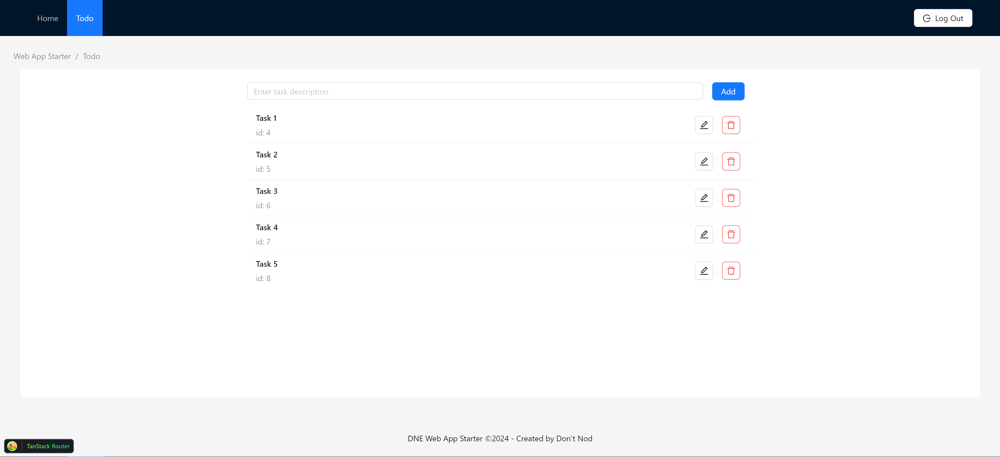
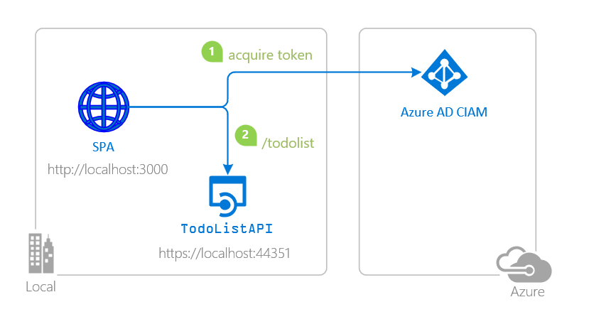

# DNE Web App Starter

This starter kit is a boilerplate based on the https://github.com/Azure-Samples/ms-identity-ciam-javascript-tutorial/tree/main/2-Authorization/1-call-api-react. It demonstrates how to build a web application with a React SPA (Single Page Application) client and a .NET 8 backend, leveraging Azure AD and MSAL for authentication. For detailed guidance on configuring Azure AD and MSAL, please refer to the [there](https://github.com/Azure-Samples/ms-identity-ciam-javascript-tutorial/tree/main/2-Authorization/1-call-api-react).



# Scenario
1. The client **React SPA** uses the to sign-in a user and obtain a JWT ID Token from Azure AD for Customers.
2. The **ID Token** proves that the user has successfully authenticated against Azure AD for Customers.


# Prerequisites
- Either [Visual Studio](https://visualstudio.microsoft.com/downloads/) or Visual Studio Code and [.NET Core SDK](https://www.microsoft.com/net/learn/get-started)
- [Node.js](https://nodejs.org/en/download/current).
- An Azure AD tenant.

# Setup the starter

## Setup the Client
For details on setting up and running the client, see the [Client documentation](/src/Client/README.md)

## Setup the API
For details on setting up and running the service, see the [Service documentation](/src/Api/README.md)

# Docker
Create a `.env` file at the root of the project and populate it with the following values to configure your environment:
```sh
AZURE_TENANT_ID={your_azure_tenant_id}
AZURE_CLIENT_ID={your_azure_api_application_client_id}
VITE_AZURE_CLIENT_ID={your_azure_spa_application_client_id}
VITE_AZURE_AUTHORITY=https://login.microsoftonline.com/{your_tenant_id}
VITE_TODO_API_ENDPOINT_URL=http://localhost:8080
VITE_TODO_API_SCOPES_READ=["api://{your_azure_api_application_id}/ToDoList.Read"]
VITE_TODO_API_SCOPES_WRITE=["api://{your_azure_api_application_id}/ToDoList.ReadWrite"]
```
```bash
docker compose up
```

## Running the app in a Dev Container
This project supports opening directly in a fully configured development container using Visual Studio Code's Dev Container feature. The provided Docker image comes pre-configured with the .NET SDK and Node.js, setting up a ready-to-run development environment for the application.

1. **Install Prerequisites:**

Ensure that you have Visual Studio Code installed along with the Remote - Containers extension. You will also need Docker installed and running on your machine.

2. **Open the Project in VS Code:**

Open the project folder in Visual Studio Code. VS Code may prompt you to reopen the project in a container. If it does not, you can manually reopen it in a container by following the next step.

3. **Reopen in Container:**

Use the Command Palette (`Ctrl+Shift+P` or Cmd+Shift+P on Mac) and select 'Remote-Containers: Reopen in Container'. This command will start the process of building the Docker image (if it's not already built) and configuring the container.

4. **Verify Environment:**

Once the container is running, open a terminal in VS Code to verify that the .NET SDK and Node.js are installed correctly by running `dotnet --version` and `node --version`.

## Running the App in Production Using Docker
This project can be deployed and run within a Docker container. First, ensure you have created and configured the `.env` file as described in the previous documentation sections. This file should contain all necessary environment variables for the application to run correctly in production.

Once the .env file is set up, execute the following command to build and start the Docker container:

```sh
docker compose up --build -d
```

This command performs the following actions:

- `--build`: This option ensures that Docker builds the images before starting the containers, which is essential if you have made changes to the Dockerfile or other components of the Docker setup.

- `-d`: This runs the containers in detached mode, meaning they run in the background and do not block the terminal.

Ensure Docker is installed and running on your machine before executing the command. This setup allows for a streamlined deployment process, encapsulating the application within a container for consistent performance across different environments.