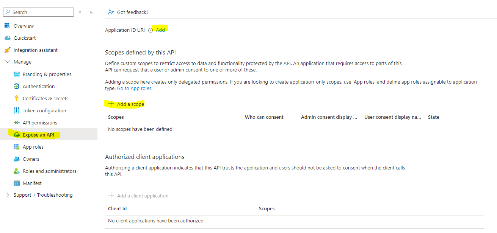
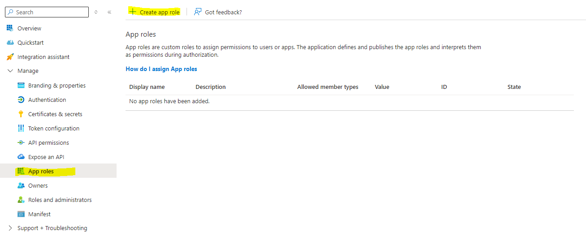

# DNE Web App Starter - Service

## EntraID/AzureAD setup
### Create an App registration
It must be single-tenant. This identity is used to manage user access.
#### Manually
1. Navigate to the [Azure portal](https://portal.azure.com/) and select the `Microsoft Entra ID`.
1. Select `Manage > App Registrations` blade on the left, then select `New registration`.
1. In the Register an application page that appears, under `Supported account types`, select `Accounts in this organizational directory only` and click on `Register`.
1. In the `Overview` blade, find and note the `Application (client) ID`. You use this value in your app's configuration file(s) later in your code.

#### CLI
First install az cli and sign in `az login --allow-no-subscriptions`, then run:
```
echo "Name of Application Identity? (Type and press enter to continue)" && read -r APP_NAME
APP_ID=$(az ad app create --display-name $APP_NAME --sign-in-audience AzureADMyOrg --query appId --output tsv)
```

### Setup scopes (Delegated Permissions)
#### Manually
All APIs must publish a minimum of one scope, also called [Delegated Permission](https://learn.microsoft.com/en-us/entra/identity-platform/permissions-consent-overview#permission-types), for the client apps to obtain an access token for a user successfully. To publish a scope, follow these steps:
1. In the `Manage > Expose an API` blade, you can publish the permission as an API for which client applications can obtain access tokens for. The first thing that we need to do is to declare the unique resource URI that the clients will be using to obtain access tokens for this API. To declare an resource URI(`Application ID URI`), follow the following steps:
   1. Select Set next to the `Application ID URI` to generate a URI that is unique for this app.
   1. For this sample, accept the proposed `Application ID URI` (`api://{clientId}`) by selecting Save.
   
1. Add scopes
   1. Select `Add a scope` button and enter the values as indicated below:
      
   1. ⚠️ Repeat the steps above for another scope named `ToDoList.ReadWrite`

> [!TIP]
> Follow the [principle of least privilege when publishing permissions](https://learn.microsoft.com/en-us/security/zero-trust/develop/protected-api-example) for a web API.

#### CLI
```
uuid1=$(uuidgen)
uuid2=$(uuidgen)
cat <<EOF > claims.json
{
    "acceptMappedClaims": null,
    "knownClientApplications": [],
    "oauth2PermissionScopes": [
      {
        "adminConsentDescription": "Read and Write Todo list",
        "adminConsentDisplayName": "Read and Write Todo list",
        "id": "$uuid1",
        "isEnabled": true,
        "type": "User",
        "userConsentDescription": null,
        "userConsentDisplayName": null,
        "value": "ToDoList.ReadWrite"
      },
      {
        "adminConsentDescription": "Allows the app to read the todo list",
        "adminConsentDisplayName": "Read Todo list",
        "id": "$uuid2",
        "isEnabled": true,
        "type": "User",
        "userConsentDescription": null,
        "userConsentDisplayName": null,
        "value": "ToDoList.Read"
      }
    ],
    "preAuthorizedApplications": [],
    "requestedAccessTokenVersion": null
  }
EOF

az ad app update --id $APP_ID --identifier-uris api://$APP_ID --set api=@claims.json
```

### Setup roles and permission (Application Permissions)
All APIs should publish a minimum of one App role for applications, also called [Application Permission](https://learn.microsoft.com/en-us/entra/identity-platform/permissions-consent-overview#permission-types), for the client apps to obtain an access token as themselves, i.e. when they are not signing-in a user. Application permissions are the type of permissions that APIs should publish when they want to enable client applications to successfully authenticate as themselves and not need to sign-in users. To publish an application permission, follow these steps:
1. Still on the same app registration, select the App roles blade to the left.
1. Select `Create app role`

1. Create app role using the following setup

> ⚠️ Repeat the steps above for another role named `ToDoList.ReadWrite.All`
#### Manually
#### CLI
```
cat <<EOF > roles.json 
[{
   "allowedMemberTypes": [
       "User",
       "Application"
   ],
   "description": "Allow the app to read and write every user's ToDo list using the todo api",
   "displayName": "ToDoList.ReadWrite.All",
   "isEnabled": true,
   "value": "ToDoList.ReadWrite.All"
},
{
   "allowedMemberTypes": [
       "User",
       "Application"
   ],
   "description": "Allow the app to read every user's ToDo list using the todo api",
   "displayName": "ToDoList.Read.All",
   "isEnabled": true,
   "value": "ToDoList.Read.All"
}]
EOF

az ad app update --id $APP_ID --app-roles @roles.json
```

## Application Setup

### Restore dependencies
To install project dependencies, run the following command:
```sh
# Restore the nuget packages
dotnet restore

# Restore the tools
cd service/DNE.Todo.API 
dotnet tool restore
```

### App secrets
The Client ID and the Tenant ID need to be set as user secrets in order to use the Azure ad for the authentication / authorization
```sh
# Client ID
dotnet user-secrets set "AzureAd:ClientId" "aaaaaaaa-aaaa-aaaa-aaaa-aaaaaaaa" --project "service/DNE.Todo.API"

# Tenant ID
dotnet user-secrets set "AzureAd:TenantId" "bbbbbbbb-bbbb-bbbb-bbbb-bbbbbbbb" --project "service/DNE.Todo.API"
```

### App settings
[appsettings.json](appsettings.json) can be edited to match your needs. This files contains the `scope names` / `app permissions` (user roles) / `claim settings` for Azure AD.

# Run the project
```sh
dotnet run
```


# Code Structure

## `Controllers`

This directory contains all the mvc controllers of the API

- [Controllers/ToDoListController.cs](Controllers/ToDoListController.cs): Example of a CRUD controller to manage a todo list.

## `Models`

This directory contains all the models used by the application.

## `DbContext`

Db Context for the entity framework.

## `Permissions`

Contains custom decorators to protect an endpoint with Azure AD **Scopes** and **Roles**.